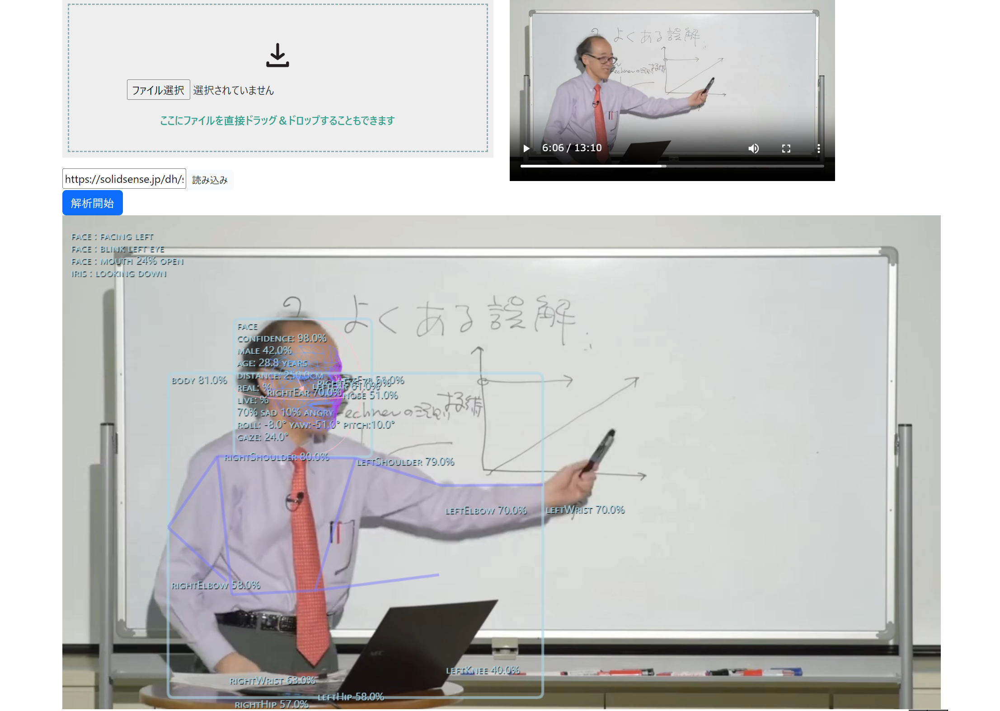
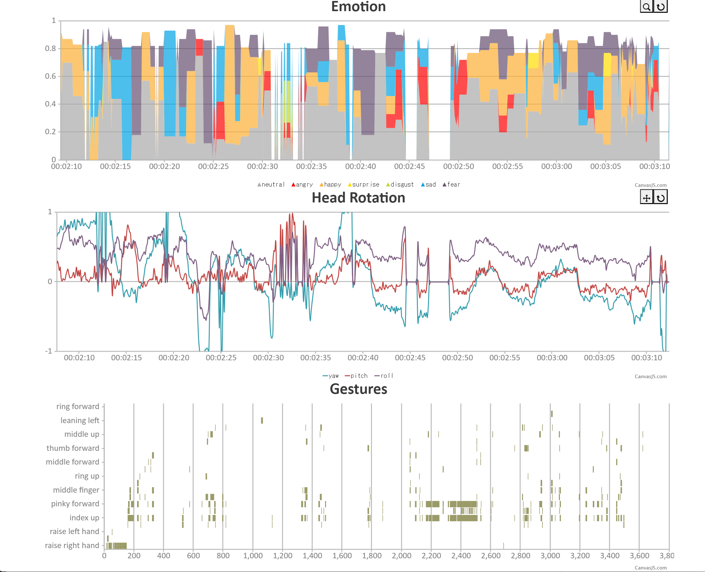

# 所作(syosa)

<p align="center">
  
</p>

## About
本ツール(syosa)は，人物による活動や発言が含まれる映像資料から，機械学習を用いた動画解析により登場人物の本人の表情や視線，瞬き，動作といった非言語情報の抽出を行い，音声認識による言語情報ともにタイムラインデータとして保存可能とする．
本ツールはWebサーバー上に実行可能な形で置くことで，Webページの形で利用可能となる．利用者がページにアクセスすると映像資料のファイルを指定することで登場人物の非言語情報の解析が行われる．読み込まれたデータはサーバーにアップロードはされず，利用者がアクセスしている計算機資源を使って処理が行われるため，いかなる利用履歴やデータ収集も行われない．

## News
- **[2024/06]** 公開バージョン（GitHub Pagesによる動作ページ）
- **[2024/04]** プロジェクトページ作成

## Demo
[デモページ](https://t0tanikawa.github.io/syosa/)で動作を確認できます．

## Futures
非言語情報を抽出するため，映像から以下の通りの情報を取得することが可能になっている．顔の表情は登場人物の感情を反映しているため極めて重要である．首の動きや瞳の方向をトレースすることで，相手への関心の高さや心理状態などを得られる可能性がある．また手の動きや体といった身振り手振りによる情報は非言語コミュニケーションの重要な要素である．口の開口率については感情や声の強さなどを表し伝えたい内容の理解において有用である．その他，年齢や性別，人物同定はコミュニケーションの理解を支援するために実装をおこなった．

- 身体および顔のランドマークの座標
- 顔の姿勢
- 顔、身体、手のジェスチャー（状態）
- 瞳の方向
- 口の開口率
- 性別推定
- 年齢推定
- 人物同定
- 物体（オブジェクト認識）
- 表情

<p align="center">
  
</p>

また，認識した結果をタイムグラフに合わせて表示でき，必要に応じて可視化内容は変更できる．表情は，基本的な6つの感情（怒り・嫌悪・恐怖・喜び・悲しみ・驚き）の比率で表示される．横軸のタイムスケールは拡大縮小可能である．身体情報としては，頷きなどに関連する頭部の姿勢情報の可視化される．ジェスチャーについても認識したものをタイムライン上に表示される．

言語情報については，時間指定のテキストトラック（字幕やキャプションなど）を表示するためのウェブビデオテキストトラック形式 (WebVTT) を読み込むことで対応する．

## Acknowledgment
本ツールは，大学共同利用機関法人人間文化研究機構の2023年度デジタル・ヒューマニティーズ(DH)研究等補助事業の支援を受けて開発された．

## Credits
本プログラムは以下のライブラリおよび学習データを使用している．
```
Human Library: MIT License
Used Models:
  PoseNet: Apache License Version 2(TensorFlow)
  Oarriaga Emotion: MIT License
  MediaPipe Iris: Apache License Version 2
  HSE-FaceRes: Apache License Version 2
  MediaPipe BlazeFace: Apache License Version 2
  MediaPipe FaceMesh: Apache License Version 2
  MediaPipe HandLandmark Lite: Apache License Version 2
  HandTracking: MIT License
ChartJS: MIT License
Hammer.js: MIT License
Moment.js: MIT License
Bootstrap: MIT License
```
